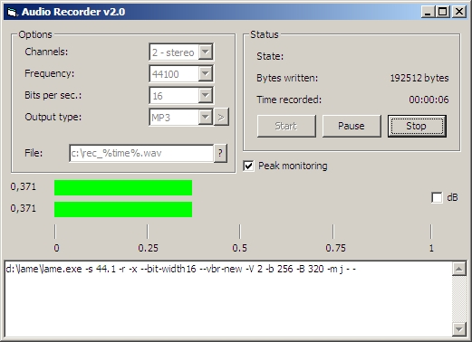

<div align="center">

## Audio Recorder v2\.3


</div>

### Description

Update! Fixed some things (like stucking peak monitoring, and others). Added logging function. Activate it by setting first variable in modWaveIn Debuging to true. If it crashes, send here, last 5-10 entries + describe what you did and the crash MUST be repeatable.

New Version! Support for MP3 encoding (through lame.exe), decibels, separate recording for peakmeter (no need to use "Do not write to file" option).

Recording application, which uses Windows Mixer Recording input to record to WAVE/MP3 (OGG Vorbis support is planned).

KNOWN ISSUES: sometimes it does crash (little, but still existing chance). !!! When recording to VBR, the VBR header doesn't get written, which _might_ lead to wrong length in media players. If someone posts a good code in VB that will update correctly VBR header, post a comment below, thx! DON'T FORGET TO VOTE! Thanks!
 
### More Info
 


<span>             |<span>
---                |---
**Submitted On**   |2008-02-22 22:18:32
**By**             |[mnn](https://github.com/Planet-Source-Code/PSCIndex/blob/master/ByAuthor/mnn.md)
**Level**          |Advanced
**User Rating**    |4.4 (40 globes from 9 users)
**Compatibility**  |VB 6\.0
**Category**       |[Complete Applications](https://github.com/Planet-Source-Code/PSCIndex/blob/master/ByCategory/complete-applications__1-27.md)
**World**          |[Visual Basic](https://github.com/Planet-Source-Code/PSCIndex/blob/master/ByWorld/visual-basic.md)
**Archive File**   |[Audio\_Reco210496362008\.zip](https://github.com/Planet-Source-Code/mnn-audio-recorder-v2-3__1-70064/archive/master.zip)

### API Declarations

```
Many.
waveIn* for recording
mmioStringToFOURCC for WAVE header
memory functions (like CopyMemory, GlobalAlloc and so on)
subclassing functions (SetWindowLong, CallWindowProc)
```


